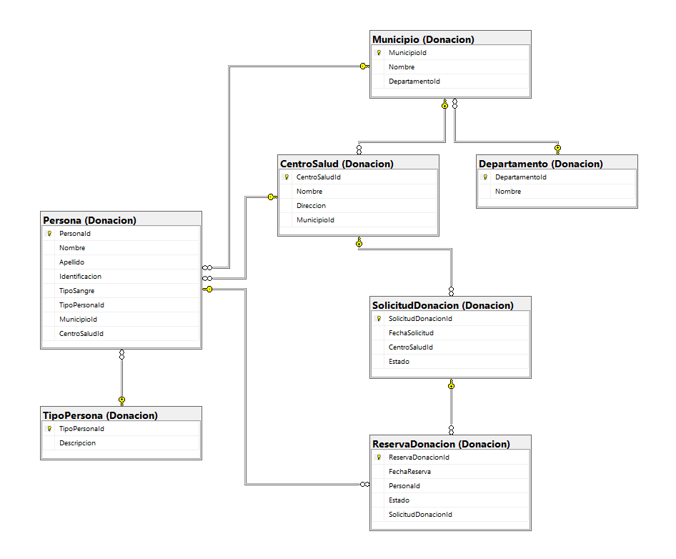
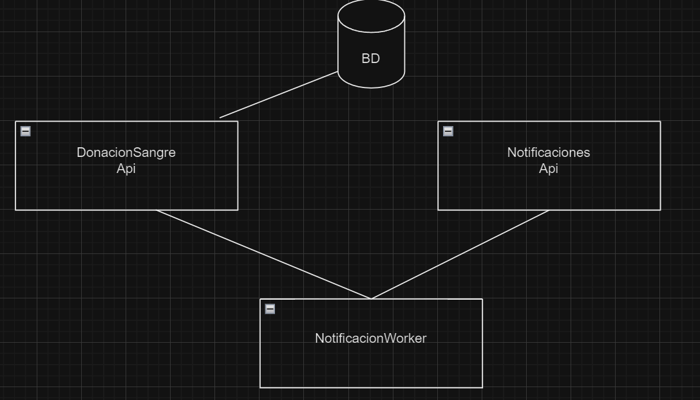
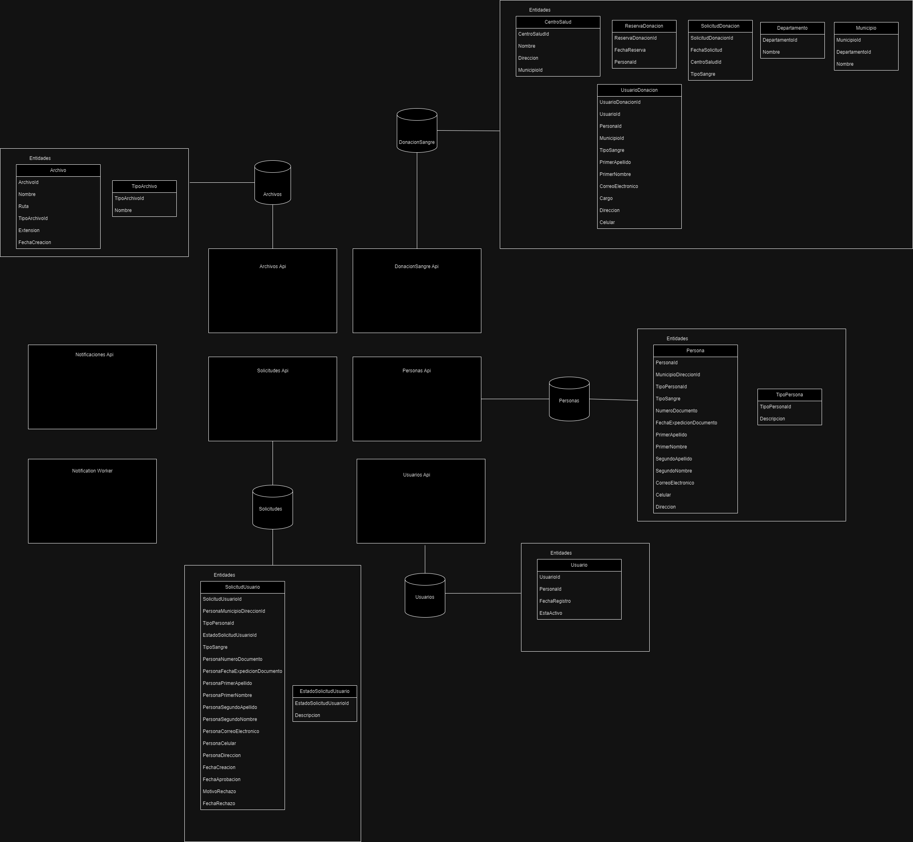

# Blood Donation System

## Descripción

El sistema de **Blood Donation** es una aplicación diseñada para conectar personas con recolectores de sangre en el momento y lugar adecuados. El objetivo principal es ayudar a salvar vidas humanas al facilitar el proceso de donación de sangre de manera eficiente y organizada. 

El sistema permite a los donantes registrarse, gestionar solicitudes de donación y reservas, y proporciona a los centros de salud un seguimiento completo de las citas, además de un canal para notificar la necesidad de sangre.

## Funcionalidades Principales

- Registro de donantes y enfermeros.
- Solicitud de sangre en una zona específica.
- Reserva de donación de sangre validando tipo de sangre y zona adecuada.
- Sincronización de datos entre SQL Server y MongoDB, manteniendo la separación de comandos y consultas.
- Notificaciones automáticas para donantes cuando se necesita su tipo de sangre en su área.

## Arquitectura del Proyecto Y Patrones de Diseño Utilizados

- **CQRS (Command Query Responsibility Segregation)**: Separa las operaciones de lectura y escritura, mejorando el rendimiento y la escalabilidad del sistema.
- **Domain-Driven Design (DDD)**: Organiza la lógica de negocio en entidades, objetos de valor y agregados, reflejando fielmente los conceptos del dominio.
- **Mediador (Mediator)**: Facilita la comunicación entre comandos y consultas usando **MediatR**, desacoplando la lógica de los controladores y mejorando la mantenibilidad.
- **Repositorio (Repository)**: Proporciona una capa de abstracción sobre el acceso a datos, separando la lógica de negocio del acceso a bases de datos SQL Server y MongoDB.
- **Unidad de Trabajo (Unit of Work)**: Garantiza que las operaciones sobre la base de datos se gestionen como una única transacción, manteniendo la consistencia de los datos.
- **Inyección de Dependencias (Dependency Injection)**: Facilita la configuración y gestión de las dependencias entre componentes, mejorando la modularidad y testabilidad del código

### Tecnologías Utilizadas

- **.NET 8** para la implementación del backend.
- **Entity Framework Core** para la gestión de la base de datos SQL Server.
- **MongoDB** para la gestión de las consultas y lectura rápida de datos.
- **Carter** para la definición y manejo de los endpoints.
- **MediatR** para implementar CQRS en la comunicación entre los comandos y consultas.
- **Swagger** para la documentación interactiva de la API.

## Diagrama Entidad-Relación (ER)

A continuación se muestra el diagrama ER del sistema, que incluye las entidades principales y sus relaciones:

 <!-- Reemplaza con la ruta correcta de la imagen en tu repositorio -->

## Diagrama Apis



## Diagrama Apis y Bases de datos segunda entrega



## Link de video explicativo

[Video explicativo en Google Drive](https://drive.google.com/file/d/14qMPHiIEc0VqOaYUGYfJuwdCTKf5WOEj/view?usp=drive_link)

## Instalación y Configuración

### Requisitos Previos

- **.NET SDK 7.0 o superior**
- **SQL Server**
- **MongoDB**
- **Visual Studio 2022** o **Visual Studio Code**

### Pasos para Ejecutar el Proyecto

1. **Clonar el Repositorio**

   ```bash
   git clone https://github.com/tu_usuario/blood-donation.git
   cd blood-donation
